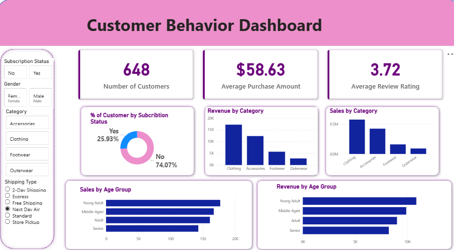

# Customer Shopping Behavior Analysis

This project analyzes customer shopping behavior using transactional data from 3,900 purchases across various product categories. The goal is to uncover insights into spending patterns, customer segments, product preferences, and subscription behavior to guide strategic business decisions.

Demo:  
 

Link to project: [https://github.com/Rebyoo13/sudoku-solver](https://github.com/Rebyoo13/customer_data_analysis)

---

## Dataset Summary
- **Rows:** 3,900  
- **Columns:** 18  

### Key Features
- **Customer demographics:** Age, Gender, Location, Subscription Status  
- **Purchase details:** Item Purchased, Category, Purchase Amount, Season, Size, Color  
- **Shopping behavior:** Discount Applied, Promo Code Used, Previous Purchases, Frequency of Purchases, Review Rating, Shipping Type  

### Missing Data
- 37 values in the Review Rating column

---

## Exploratory Data Analysis (Python)

### Data Loading
- Imported dataset using `pandas`

### Initial Exploration
- Used `df.info()` for dataset structure  
- Used `.describe()` for summary statistics  

### Missing Data Handling
- Imputed missing Review Ratings using median per product category  

### Column Standardization
- Renamed columns to snake case for readability  

### Feature Engineering
- Created `age_group` column by binning customer ages  
- Created `purchase_frequency_days` from purchase history  

### Data Consistency Check
- Verified discount and promo code usage; dropped redundant `promo_code_used`  

### Database Integration
- Connected Python to PostgreSQL and loaded cleaned DataFrame for SQL analysis  

---

## Data Analysis using SQL (PostgreSQL)
Performed structured analysis to answer key business questions:

- **Revenue by Gender:** Total revenue comparison between male and female customers  
- **High-Spending Discount Users:** Customers using discounts but spending above average  
- **Top 5 Products by Rating:** Products with highest average review ratings  
- **Shipping Type Comparison:** Average purchase amount for Standard vs. Express shipping  
- **Subscribers vs. Non-Subscribers:** Average spend and total revenue per subscription status  
- **Discount-Dependent Products:** Top 5 products with highest percentage of discounted purchases  
- **Customer Segmentation:** Classified customers into New, Returning, and Loyal  
- **Top 3 Products per Category:** Most purchased products in each category  
- **Repeat Buyers & Subscriptions:** Checked if customers with >5 purchases are more likely to subscribe  
- **Revenue by Age Group:** Contribution of each age group to total revenue  

---

## Dashboard in Power BI
Built an interactive dashboard to visualize insights:

- Revenue by demographic groups  
- Product popularity and ratings  
- Subscription patterns  
- Discount impact on sales  

---

## Business Recommendations
- **Boost Subscriptions:** Promote exclusive benefits for subscribers  
- **Customer Loyalty Programs:** Reward repeat buyers to move them into the “Loyal” segment  
- **Review Discount Policy:** Balance sales boosts with margin control  
- **Product Positioning:** Highlight top-rated and best-selling products in campaigns  
- **Targeted Marketing:** Focus efforts on high-revenue age groups and express-shipping users  

## Lessons Learned

* Cleaning and preparing real-world transactional datasets using Python and SQL.  
* Performing feature engineering to create meaningful variables for analysis.  
* Writing SQL queries to answer practical business questions.  
* Visualizing data effectively using Power BI dashboards.  
* Translating data insights into actionable business recommendations.

````


